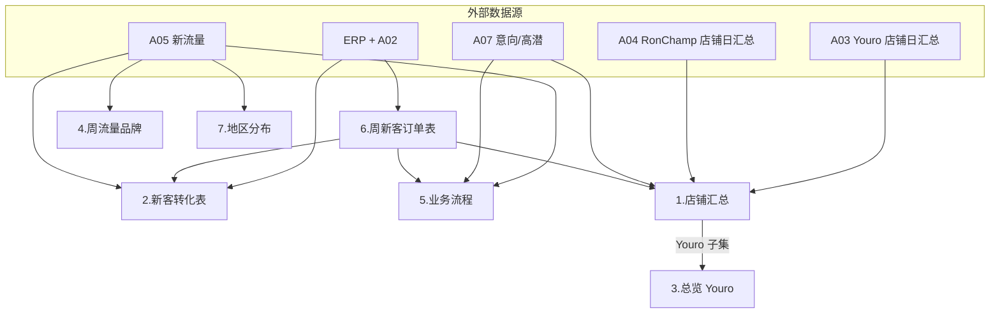

# Youro 周分析表 · Sheet 依赖与填表顺序

> **对象**：`2026年Youro运营数据周分析表（*.xlsx）`（7 Sheet）+ `2026年Ronchamp运营数据周分析表（*.xlsx）`（7 Sheet，结构不同）  
> **脚本**：`generate_weekly_new_orders.py` → `review/` CSV  
> **每周 SOP**：[`每周运营SOP.md`](每周运营SOP.md)

---

## 1. 两份文件的关系

| 文件 | 角色 |
|------|------|
| 上周 xlsx | **定稿归档** |
| 本周 xlsx | 复制上周 → 改文件名 → **只填当周新增列/行/订单块** + 刷新 Sheet 2 月累计 |

**共性**

- 历史周次列/行**滚动累积**，不回改旧周（除非纠错）。
- 新一周 = 复制文件 + 脚本出数 + 粘贴。

**RonChamp 差异**

| Youro | RonChamp |
|-------|----------|
| Sheet 1 **店铺汇总**（双店 Youro \| RonChamp） | ❌ 无；镕川指标在 **Sheet 1 总览** |
| Sheet 3 **总览**（仅 Youro） | Sheet 1 **总览**（= Youro Sheet3 口径 + **买家周注销账号**） |
| Sheet 4 品牌 / Sheet 7 地区 | Sheet 2 品牌 / Sheet 5 地区 |
| Sheet 5 业务流程 | Sheet 3 业务流程 |
| Sheet 6 周新客 | Sheet 4 周新客 |

---

## 2. Youro 七个 Sheet

| # | Sheet | 粒度 | 本周新增 | 脚本 CSV |
|---|-------|------|----------|----------|
| 1 | 店铺汇总 | 周 · 双店列 | +1 列 | `Step6-店铺汇总-*.csv` |
| 2 | 新客转化表 | **月累计** | 整表重算 | `2.新客转化表.csv` |
| 3 | 周数据表（总览） | 周 · Youro | +1 列 | `Step7-Youro-周数据总览-*.csv` |
| 4 | 周流量分析（品牌） | 周 | +1 列 | `Step3-Youro-周流量品牌-*.csv` |
| 5 | 周数据表（业务流程） | 周 | +1 行 | `Step4-Youro-业务流程-*.csv` |
| 6 | 周新客订单表 | 周 | +订单块 | `6.周新客订单表-Youro.csv` |
| 7 | 新流量地区分布 | 周 | +1 组列 | `Step3-Youro-新流量地区-*.csv` |

### 数据源摘要

| Sheet | 主数据源 |
|-------|----------|
| 1 基础/运营 | **A03** / **A04** `N月店铺数据` 聚合 7 日 |
| 1 订单段 | A07（**新客意向按 A05 拆店**）+ 周新客 CSV |
| 2 | API 首单 + A05 + A02 + exceptions |
| 3 | 与 Step6 **Youro 列**同源（+ L3+） |
| 4 / 7 | **A05** 新流量（品牌 / 国家） |
| 5 | **A05** + **A07**（按 A05 拆店）+ 周新客汇总 |
| 6 | API + A02 + A05 |

---

## 3. Sheet 间依赖

---

## 4. 推荐填表顺序

| 步骤 | Youro Sheet | RonChamp Sheet | CSV |
|------|-------------|----------------|-----|
| 0 | — | — | 源 Excel + API 备数 |
| 1 | 6.周新客 | 4.周新客 | `6.*` / `4.*` |
| 2 | 2.新客转化 | — | `2.新客转化表.csv` |
| 3 | 4.品牌 | 2.品牌 | `Step3-*-周流量品牌` |
| 4 | 7.地区 | 5.地区 | `Step3-*-新流量地区` |
| 5 | 5.业务流程 | 3.业务流程 | `Step4-*-业务流程` |
| 6 | 1.店铺汇总 | — | `Step6-*`（RonChamp 列） |
| 7 | 3.总览 | 1.总览 | `Step7-*` |
| 8 | — | 1.总览 | **买家周注销账号** 手填 |

---

## 5. 脚本覆盖一览（2026-06-30）

| 用途 | 状态 | review 文件 |
|------|------|-------------|
| 周新客订单 | ✅ | `6.*` / `4.*` |
| 新客转化表 | ✅ | `2.新客转化表.csv` |
| 品牌流量 Step③ | ✅ | `Step3-*-周流量品牌` + 其它杂类明细 |
| 地区分布 Step③ | ✅ | `Step3-*-新流量地区` |
| 业务流程 Step④ | ✅ | `Step4-*-业务流程` + 各店意向/高潜明细 + `Step4-A07-店铺推断` |
| 店铺汇总 Step⑥ | ✅ | `Step6-店铺汇总` |
| 总览 Step⑦ | ✅ | `Step7-Youro` / `Step7-RonChamp` |
| 交叉核对 | ✅ | `流量交叉核对-*` / `渠道未归类` 等 |
| xlsx 全自动 | ❌ | 默认 CSV；`--write-xlsx` 仅 6./4. 订单 Sheet |
| RonChamp 注销账号 | ❌ | 国际站后台手填 |

---

## 6. 跨 Sheet 自洽检查

| 检查项 | 关系 |
|--------|------|
| Step3 周总流量 ≈ Step6/7 TM+询盘 | A05 vs A03 应逐日一致 |
| Step4 新客数/额 = 周新客 CSV | 漏斗行 |
| Step7 Youro = Step6 Youro 子集 | 总览不重算 |
| Sheet 2 C = 当月首单（减 exceptions） | 见业务规则 §12 |

---

## 7. 口径备忘

- **Sheet 1 TM / L1+**：来自 **A03/A04** 日汇总求和。  
- **Step3/4/5 TM / L1+**：来自 **A05** 明细；应与 A03/A04 **周合计一致**。  
- **A07**：无店铺字段 → 通过 **A05 流量表** 推断归属，意向/高潜/截止意向 **按店拆分**（§10）。  
- **Grace/Lily 双店业务员**：有 A05 流量匹配时，订单/转化表店铺以 **流量表所属店铺** 为准（优先于 A02）。
- **L1+**：Sheet 1/3 用 A03 的 L1+ 列；Step3/4 脚本 `is_l1plus` 含 L2/L3（与 A060x 交叉核对等价规则）。

---

*文档版本：v2.0 · 2026-06-30*
