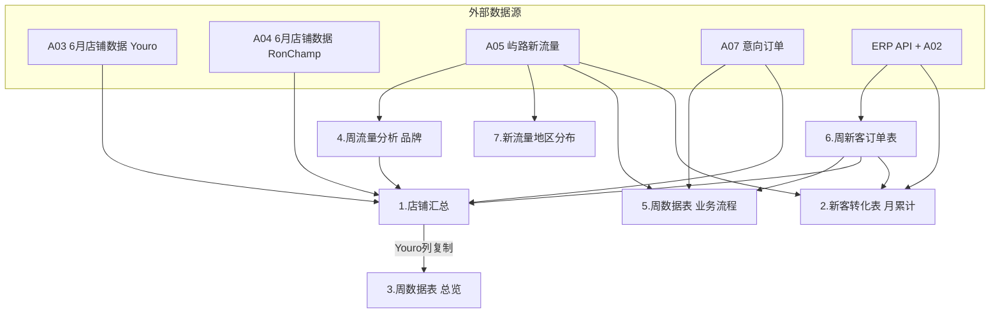

# Youro 周分析表 · Sheet 依赖与填表顺序

> **对象**：`2026年Youro运营数据周分析表（*.xlsx）`（7 个 Sheet，与 RonChamp 周表结构对称）  
> **示例**：对比 `（6.15—6.21）` 已完成周 vs `（6.22—6.28）` 进行中周  
> **目的**：理清 Sheet 之间、周次之间的依赖，避免重复录入、漏填列。

---

## 1. 两份文件的关系

| 文件 | 角色 |
|------|------|
| `（6.15—6.21）.xlsx` | **上一周定稿**：6.15—6.21 各 Sheet 该周列/行已齐 |
| `（6.22—6.28）.xlsx` | **本周 workbook**：在上周基础上**追加** 6.22—6.28，并刷新当月累计 |

**共性**

- 均为 **同一模板、7 个 Sheet、历史周次列/行滚动累积**（不是每周只保留当周）。
- 新一周 = **复制上周文件 → 改文件名 → 只填「本周新增的那一列/行/订单块」+ 刷新当月 Sheet**。

**6.22 文件当前完成度（实测）**

| Sheet | 6.22—6.28 是否已有 |
|-------|-------------------|
| 1.店铺汇总 | ✅ 已有 col 50/51（Youro/RonChamp） |
| 2.新客转化表 | ✅ 标题已改为 `6.1 - 6.28`，数据已填 |
| 3.周数据表（总览） | ❌ 最后一列为 `06.15 - 06.21`，**尚无 6.22 列** |
| 4.周流量分析（品牌） | ❌ 同上 |
| 5.周数据表（业务流程） | ❌ 最后一行仍为 `06.15 - 06.21`，**尚无 6.22 行** |
| 6.周新客订单表 | ⚠️ 仅有 **2 笔** Youro 明细（缺 Cindy 等） |
| 7.新流量地区分布 | ❌ 最后一组为 `06.15 - 06.21` |

> **原则**：旧周列/行 **不回改**（除非纠错）；本周只动 **新增列/行**。6.15 文件视为 6.15 周归档，后续在 6.22 文件继续即可。

---

## 2. 七个 Sheet 各自做什么

### 2.1 总览

| # | Sheet | 粒度 | 本周新增形式 | 店铺范围 |
|---|-------|------|--------------|----------|
| 1 | **店铺汇总** | 周 | **新增 1 列**（Youro + RonChamp 两格） | 双店 |
| 2 | **新客转化表** | **月累计** | **整表重算**（标题改为 `6.1 - 当周末`） | 双店 × 业务员 |
| 3 | **周数据表（总览）** | 周 | **新增 1 列** | **仅 Youro** |
| 4 | **周流量分析（品牌）** | 周 | **新增 1 列** | **仅 Youro**（按咨询品类/品牌） |
| 5 | **周数据表（业务流程）** | 周 | **新增 1 行** | **Youro 口径**（含意向/新客汇总） |
| 6 | **周新客订单表** | 周 | **新增订单块**（周期标题行 + N 明细行） | **本文件仅 Youro 屿路首单** |
| 7 | **新流量地区分布** | 周 | **新增 1 组列**（排名 + 国家 + 数量） | **仅 Youro** |

---

### 2.2 Sheet 1 · 店铺汇总

**结构**：行 = 指标（基础 / 运营 / 订单三段），列 = 周次 ×（Youro | RonChamp）。

**6.15 周示例（Youro 列，与 Sheet 3/4/5 可对齐）**

| 板块 | 代表指标 | 主数据源 |
|------|----------|----------|
| 基础数据 | 产品数、在架、上新、曝光、访客、点击、TM+询盘、L1+ | **A03**（Youro）/ **A04**（RonChamp）› `6月店铺数据` 聚合 7 日 |
| 运营数据 | 全站推、自然流量、广告花费、获客成本 | A03/A04 子块（全站推 / 自然 / P4P） |
| 订单数据 | 意向订单、**周新客成交数/率/额/毛利** | **A07** + **Sheet 6 汇总** + API/A02 |

**依赖**：订单段指标 **依赖 Sheet 6 先齐**；基础/运营段 **不依赖** 其他 Sheet（直接来自 A03/A04）。

---

### 2.3 Sheet 2 · 新客转化表

**结构**：月累计；列组 = TM / RFQ / 其他 ×（流量 D/E、成交 G/L/P、金额、毛利）。

**特点**

- **不是「每周加一列」**，而是每周用 **当月 1 日 ~ 当周末** 全量首单 **重算整张表**。
- 标题行：`Youro & RonChamp 业务员新客转化汇总（6.1 - 6.21）` → 周末改为 `6.1 - 6.28`。
- 与 Sheet 6 **共享订单池**（首单 + 店铺 + 渠道），但 Sheet 2 是 **业务员 × 渠道** 汇总，Sheet 6 是 **逐单明细**。

**脚本**：`review/2.新客转化表.csv` 已覆盖；规则见 [`新客转化表-字段映射方案.md`](新客转化表-字段映射方案.md)。

---

### 2.4 Sheet 3 · 周数据表（总览）

**结构**：与 Sheet 1 **Youro 列指标高度重合**（产品、曝光、TM、L1+、L3+、广告等），但 **只有 Youro、单列周次**。

**6.15 周核对**：Sheet 3 col `06.15-06.21` 与 Sheet 1 Youro col **数值一致**（如 TM+询盘 = 39，曝光 = 13482）。

**依赖**：理论上 **可从 Sheet 1 Youro 列复制**，不必独立算第二遍（避免重复工）。

---

### 2.5 Sheet 4 · 周流量分析（品牌）

**结构**

- 行：品牌/品类（台达、SEW、西门子、三菱…）×（新客流量数量 + 品类流量占比）
- 首行：**周总流量合计**

**6.15 周核对**

| 指标 | Sheet 4 | Sheet 1 Youro |
|------|---------|---------------|
| 周总流量 | 39 | TM+询盘 39 ✓ |

**数据源**：**A05** `屿路—26年新流量表`（当周 `添加日期`，按 **咨询品类** 映射品牌）+ 占比 = 品牌数 ÷ 合计。

**依赖**：与 Sheet 1 **基础段 TM 口径一致**；不依赖 Sheet 6。

---

### 2.6 Sheet 5 · 周数据表（业务流程）

**结构**：**每周一行**（col B = 周期），横向字段：

| 列 | 含义 |
|----|------|
| TM/询盘新流量 | 当周 TM+询盘数 |
| L1+ / L3+ / 占比 | 流量分级 |
| 高潜 / 意向订单 | A07 等 |
| **新客订单数量 / 金额** | **来自 Sheet 6 汇总** |

**6.15 周核对**

| 字段 | Sheet 5 | 来源 |
|------|---------|------|
| TM | 39 | = Sheet 1/4 ✓ |
| 新客订单数 | 4 | = Sheet 1 Youro 周新客数 ✓ |
| 新客金额 | 56660.158 | Sheet 6 到账 RMB 合计？（见 §5 差异） |

**依赖**：**TM 段** ← A05/A03；**新客段** ← **Sheet 6 必须先填**。

---

### 2.7 Sheet 6 · 周新客订单表

**结构**：按 **周期分块**；每块 1 行标题 `06.xx - 06.xx` + 多行 22 列明细（与脚本 CSV 一致）。

**范围**：**本 Youro 周分析表只放屿路（Youro）首单**；镕川首单在 `2026年Ronchamp运营数据周分析表` › `4.周新客订单表`。

**脚本**：`review/6.周新客订单表-Youro.csv`（已实现）。

**6.15 文件**：3 行明细；Sheet 1/5 记 **4 单** → **差 1 单**（见 §5）。  
**6.22 文件**：仅 2 行（Ennerson、Grace），**缺 Cindy** 等 API 首单。

---

### 2.8 Sheet 7 · 新流量地区分布

**结构**：每周 **一组列**（总个数 + Top N 国家排名）。

**数据源**：A05 屿路新流量，当周 `添加日期`，按 **国家** 计数。

**依赖**：与 Sheet 4 **同源不同维度**（国家 vs 品牌）；可与 Sheet 4 **同批从 A05 生成**，互不依赖。

---

## 3. Sheet 间依赖图

**要点**

- **Sheet 6、Sheet 2** 都吃 API 首单，但输出形态不同（明细 vs 月汇总）。
- **Sheet 4、Sheet 7** 可并行，都来自 A05。
- **Sheet 3** 是 Sheet 1 Youro 的 **镜像**，应 **后填、从 Sheet 1 复制**，不要第三次手算。
- **Sheet 5** 是 **流量 + 意向 + Sheet 6 新客** 的 **业务漏斗一行**，依赖 Sheet 6。

---

## 4. 推荐填表顺序（单周，避免重复工）

以 **6.22—6.28** 为例，在 **`（6.22—6.28）.xlsx`** 中操作：

| 步骤 | Sheet | 动作 | 数据源 | 说明 |
|------|-------|------|--------|------|
| **0** | — | 确认 A03/A04/A05/A07/API 已更新到当周末 | 本地 Excel + ERP | 不打开周表先备数 |
| **1** | **6.周新客订单表** | 追加周期块 + 明细行 | 脚本 CSV / API | **最先**；RonChamp 同步写 RonChamp 周表 Sheet 4 |
| **2** | **2.新客转化表** | **整表刷新**（非加列） | 脚本 CSV | 与步骤 1 同批 API；月累计 |
| **3** | **4.周流量分析** | 新增列 `06.22-06.28` | A05 品类 | 与步骤 4 可并行 |
| **4** | **7.新流量地区分布** | 新增列组 | A05 国家 | 与步骤 3 可并行 |
| **5** | **5.周数据表（业务流程）** | **新增一行** | A05 + A07 + **Sheet 6 汇总** | 新客数/金额勿手算，从 Sheet 6 聚合 |
| **6** | **1.店铺汇总** | 新增列 Youro/RonChamp | A03/A04 + Sheet 6 + A07 | 订单段与 Sheet 5 对齐 |
| **7** | **3.周数据表（总览）** | 新增列 | **从 Sheet 1 Youro 列复制** | **不要独立重算** |

**RonChamp 并行**：`2026年Ronchamp运营数据周分析表（6.22—6.28）.xlsx` 结构类似；Sheet 1 的 RonChamp 列与 A04、RonChamp 周新客表同步。

---

## 5. 跨 Sheet 自洽检查（填完当周后）

| 检查项 | 关系 |
|--------|------|
| Sheet 4 合计 = Sheet 1 Youro **TM+询盘** | 流量口径一致 |
| Sheet 5 当周 TM = 上式 | 业务流程行 |
| Sheet 5 **新客订单数** = Sheet 6 当周 **明细行数**（Youro） | 缺行即漏单 |
| Sheet 5 **新客金额** ≈ Sheet 6 **到账 RMB 合计** | 金额聚合 |
| Sheet 1 Youro **周新客数/额/毛利** = Sheet 6 汇总 | 订单段 |
| Sheet 3 当周列 = Sheet 1 Youro 列 | 防重复录入 |
| Sheet 2 **C** = 当月首单总数（含例外排除） | 见 [`业务规则汇总.md`](业务规则汇总.md) |

**已知差异（6.15 周）**

- Sheet 6 仅 **3 行** Youro 明细，Sheet 1/5 记 **4 单** → 需补 1 单或更正汇总。
- Sheet 6 到账合计 ≠ 56660（明细合计约 58053）→ 金额字段可能用 **产品 RMB** 或含 RonChamp 口径，**填表前需统一「新客金额」定义**。

---

## 6. 与脚本/automation 的对应

| Sheet | 脚本现状 | 建议 |
|-------|----------|------|
| 6.周新客订单表 | ✅ `review/6.周新客订单表-Youro.csv` | 已可用 |
| 2.新客转化表 | ✅ `review/2.新客转化表.csv` | 已可用 |
| 1.店铺汇总 | ❌ | A03/A04 聚合 + Sheet6 订单段 |
| 3.周数据表 | ❌ | **由 Sheet 1 导出**，不单独开发 |
| 4.周流量品牌 | ❌ | A05 品类聚合 |
| 5.业务流程 | ❌ | A05 + A07 + Sheet6 一行 |
| 7.地区分布 | ❌ | A05 国家 Top N |

---

## 7. 两周文件对照摘要

| 项目 | 6.15—6.21 文件 | 6.22—6.28 文件 |
|------|----------------|----------------|
| Sheet 1 当周列 | col 48/49 ✓ | col 50/51 ✓ |
| Sheet 2 标题 | `6.1 - 6.21` | `6.1 - 6.28` ✓ |
| Sheet 3/4/7 当周 | ✓ | **待加列** |
| Sheet 5 当周行 | row 47 ✓ | **待加行** |
| Sheet 6 当周块 | 3 行（缺 1 单对齐） | 2 行（**未齐**） |

---

## 8. 结论

1. **文件关系**：新周文件 = 旧周文件 **滚动副本**；只在 **新增列/行** 上工作，历史不动。  
2. **逻辑顺序**：**Sheet 6 → Sheet 2**（订单）→ **Sheet 4/7**（流量维度）→ **Sheet 5**（漏斗行）→ **Sheet 1**（双店汇总）→ **Sheet 3**（从 Sheet 1 复制）。  
3. **避免重复工**：Sheet 3 不要重算；Sheet 1 与 Sheet 4/5 的 TM 数应同源；Sheet 5 新客段从 Sheet 6 聚合。  
4. **6.22 周当前缺口**：Sheet 3/4/5/7 未建列/行；Sheet 6 未与 API 6 单对齐。

---

*文档版本：v1.0 · 2026-06-30*
